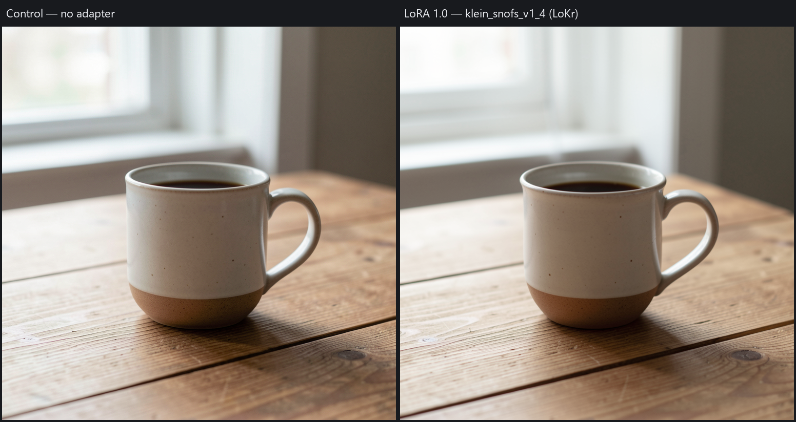

# Klein FP8 adapter: mundane live regression proof

Both fresh-runtime 768x768 seed-42 outputs are coherent images of a ceramic
coffee mug on a wooden table in soft window light. The exact formerly failing
adapter remains at strength **1.0**. The adapter image shows no global
static/noise or numerical-garbage pattern.

This proves the practical regression boundary, not broad style quality,
Comfy pixel parity, or arbitrary adapter compatibility.

- Source: accepted Krea feature head `2d107f5cca1c0e8e845435722404ac699c0b3104`.
- Fix: `fd886a9029cad28608d18002167d9e7233835d37`.
- Prompt: `A ceramic coffee mug on a wooden table in soft window light.`
- Canvas: 768x768; seed: 42; native fixed four-step Klein schedule.
- Checkpoint: `flux-2-klein-9b-fp8.safetensors`, SHA256
  `865ba09f5b4c3cbd3468a4bd3acb9fcb2f8740c54317482f0bcd4ed1d3655cee`.
- Adapter: `klein_snofs_v1_4.safetensors`, SHA256
  `512c7f1d8dc7fa5dbc1fee6049c2975ef3007300a5de1712b3e1773cb95089f7`.
  Its actual payload is LoKr: 112 updates on scaled raw FP8 modules.
- [acceptance.json](acceptance.json) contains every resolved artifact path,
  complete artifact/output hashes, decoded image metadata and environment.

The invocation uses the unchanged native Klein runtime from the isolated
feature checkout, in the configured Engine Python environment. This accepted
branch applies Klein adapters at fixed unit strength, equivalent to the original
working-checkout Recipe's explicit strength 1.0. No ordinary HTTP job is claimed
for this fresh pair. The managed service, original user Recipe, original dirty
checkout and desktop project were not modified.

The first attempt used the wrong Python environment and stopped before output
on a VAE library signature mismatch. A subsequent inspection script retained
control-model references and exhausted memory before the adapter case; the
observer was corrected and the adapter was run in a fresh process. Neither
retry changed product code, artifacts, prompt, seed, strength or dimensions.
The accepted adapter process completed, closed the runtime and exited 0.

The existing exact FP8 scale regression covers LoRA and LoKr deltas; no redundant
test was added. See [verification.json](verification.json) for repeated tests,
hosted CI and the explicitly non-green Ruff checks on unchanged accepted source.
