# Krea 2 Turbo T2I oracle

Captured 2026-09-13 on the existing RTX 5080 PyTorch baseline, ComfyUI
`12d5279438bfefc058a269eae805ceab6047777f` (0.34.0), Torch 2.11.0+cu130,
Python 3.13.12, comfy-aimdo 0.4.15, comfy-kitchen 0.2.31, frontend 1.51.9.
The frozen oracle and measured native results are retained together here.
See `final-performance.json` for the narrow baseline timing exception,
`bf16-parity.json` for exact BF16 cases, and `lora-matrix.json` for adapter
correctness, timing, resource use, and its explicit FP8 pixel-parity caveat.

`curated-t2i.json` is the current `image_krea2_turbo_t2i` template from
Comfy-Org/workflow_templates commit `5ec2c667b540389b74a3442947ab2cdfe6e0c59e`.
The installed gallery copy and freshly fetched upstream file both hash to
`d04b37d8345b1bf6aa247ef182a4454e0221730cf353379af27b20e932e9f11f`.
The API fixture was exported by the real frontend `app.graphToPrompt()` after
changing only four model selector paths to the installed M-drive hierarchy.
The MCP/CLI frontend converter did not preserve outer promoted subgraph values
(seed and thinking differed); its first successful smoke is excluded. Execute
the frontend-exported `turbo-t2i-api.json` through comfy-local instead.

## Effective behavior

- Original detailed hand/martini-glass prompt is in the API fixture; the exact
  Qwen expansion is `expanded-prompt.txt`. Enhancement is on, thinking off,
  text seed 0, maximum 512 tokens, sampling temperature .7/top-k 64/top-p .95/
  min-p .05/repetition penalty 1.05/presence penalty 0.
- Image seed 594361197674106; Euler/simple, 8 steps, CFG 1, denoise 1.
  The negative branch is zeroed and CFG 1 executes conditional-only denoising.
- Resolution selector 1 megapixel, multiple 8: square 1024×1024; second fixture
  changes only aspect to 16:9 and produces 1368×768. Patch padding/cropping
  must preserve this non-multiple-of-16 output width.
- LoRA toggle is false: the optional darkbrush file is installed and hashed
  but the lazy branch does not load it. Enabled template trigger concatenation
  occurs **after** prompt enhancement; its current trigger/strength are fixture
  values, not a generic rule for all official LoRA cards.
- Text generation executes BF16. Conditioning executes FP32, taps layers
  2,5,8,…,35 into [1,12,184,2560], strips 34 prefix tokens and flattens to
  [1,150,30720]. Model input conditioning is then cast to BF16.
- Noise is CPU FP32 [1,16,1,128,128]. The nine measured sigma values, first
  model input/output, sampled latent, decoder input/output hashes and numerical
  summaries are in `boundary-summary.json`. The model uses BF16 activations,
  mixed FP8/full-precision matmul flags and dynamic AIMDO loading.
- VAE receives FP32 [1,16,1,128,128] and returns FP32
  [1,1,1024,1024,3] on CPU. SaveImage clamps/scales to 8-bit RGB PNG.

## Initial reference measurements and limitations

Uninstrumented cold execution: 58.509 seconds. Five warm executions changed
only image seed by +1 through +5, proving sampler execution despite text cache:
25.017, 24.101, 81.950, 20.260, 12.532 seconds; median **24.101 seconds**.
The large variance is unresolved; do not discard the slow run or use this
initial campaign as the final performance gate. The subsequent paired native
comparison is in `final-performance.json`; every block is retained separately.

Resource sampling every ~50 ms used total-device NVML dedicated memory and
the sum of process-tree working sets. Peaks were 16,411,357,184 bytes GPU
(15.285 GiB) and 21,368,778,752 bytes process RAM (19.901 GiB). Total-device
VRAM includes desktop/other occupants, so paired comparisons need equivalent
external occupancy. These are not Torch reserved-memory measurements.

A second fresh-process canonical run with temporary boundary capture produced
exactly the same PNG bytes and RGB pixels (MAE/RMSE/max error all zero).
The widescreen case completed as well. `output-manifest.json` records locations,
geometry and hashes. Selected image comparisons are tracked below; full tensor
captures and the larger generation corpus remain local. Detailed histories live in
`reference/local/krea2/oracle/`. Temporary Comfy runtime instrumentation was
removed after capture; authoritative measurements use clean reference restarts.

Artifact sources, revisions, sizes and SHA256 are in `artifacts.json`. The
official weights use the Krea 2 Community License; source-code licensing is
separate. Primary authorities: [Krea](https://github.com/krea-ai/krea-2),
[Comfy weights](https://huggingface.co/Comfy-Org/Krea-2), and
[Comfy tutorial](https://docs.comfy.org/tutorials/image/krea/krea-2).

## Three-style image comparison

These are the untouched reference and final native FP8 outputs from the same
scene, seed, adapter and trigger. Composition and style remain coherent; drawing
details differ. Exact untouched-reference FP8 LoRA parity is not claimed.
BF16 with the current official Darkbrush matches the reference pixels exactly.

| Style | Comfy reference | Native |
|---|---|---|
| Darkbrush | 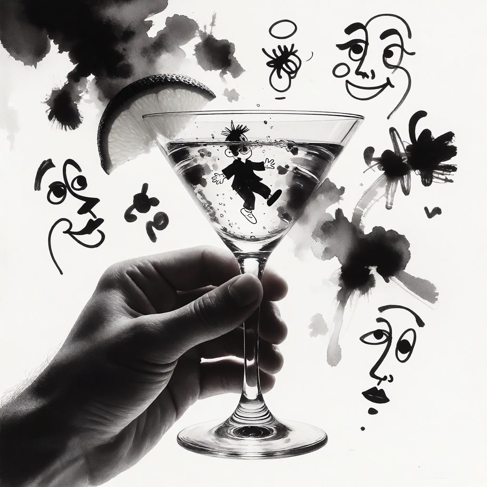 | 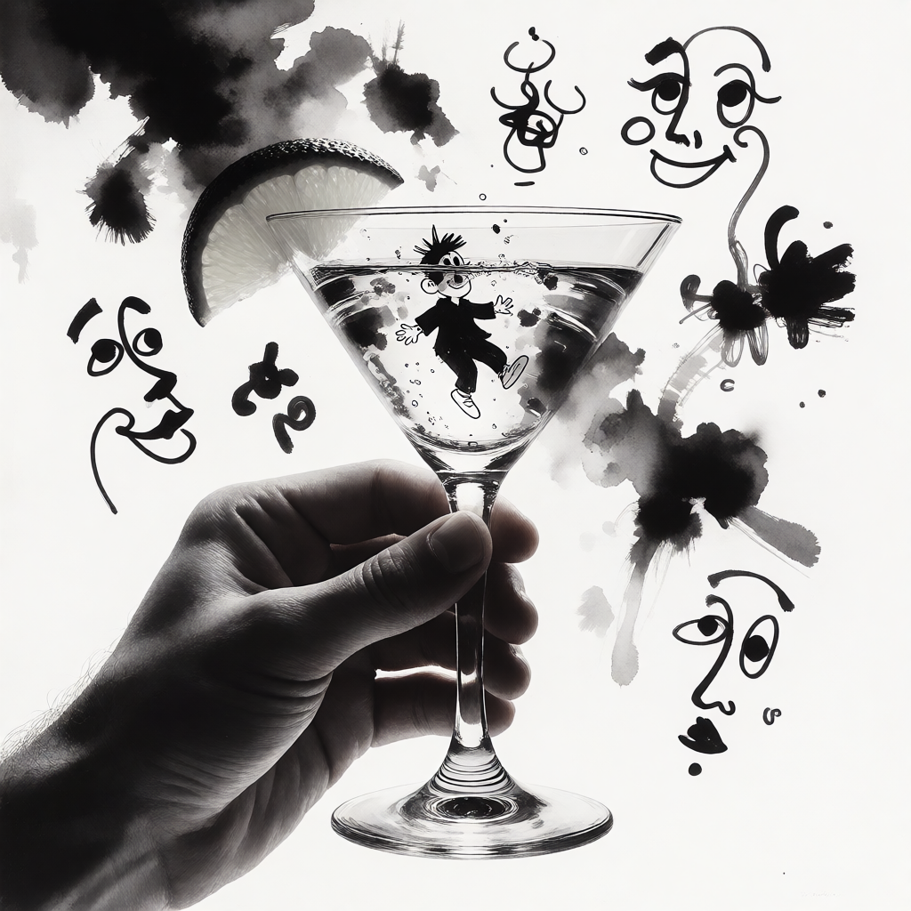 |
| Retroanime | 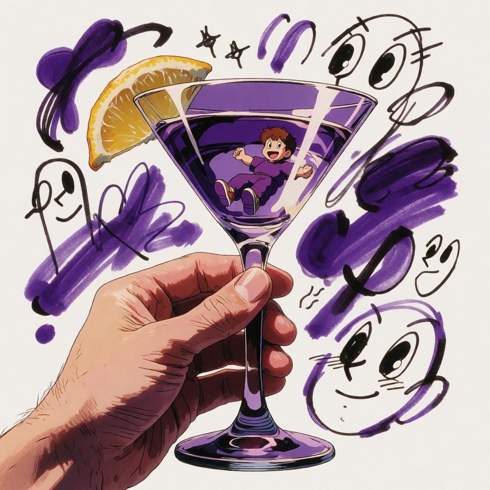 | 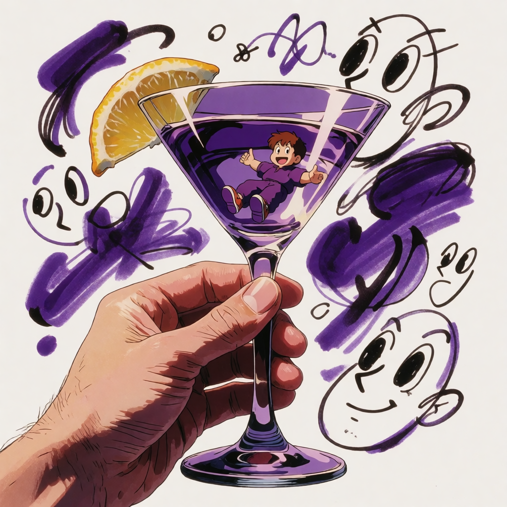 |
| Rainywindow | 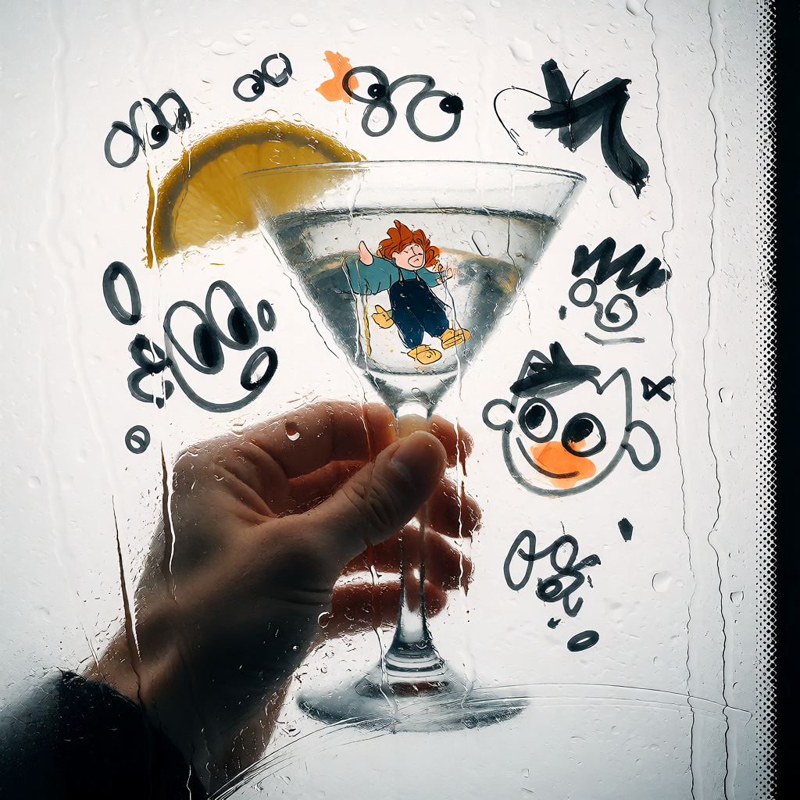 | 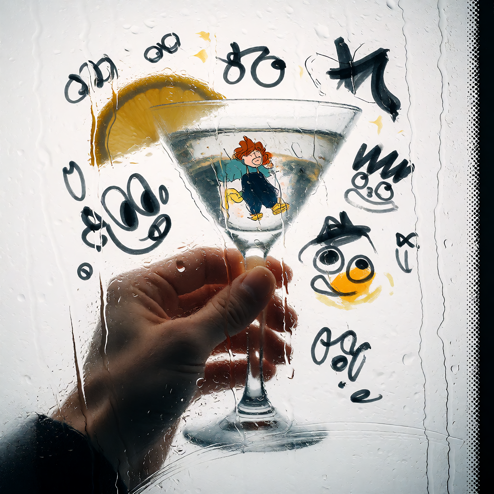 |

## Final native result and integration

Product source: `fc134b21ad87edcbbc1af56462b6b820ab0cde68` on
`EnviralDesign/LatentSlate-Engine:codex/krea2-native`. Desktop:
`2e312d804694d745687fdcf86f669298be7a73ea` on
`EnviralDesign/LatentSlate:codex/krea2-native`; no Rust changes were needed.
Both original working checkouts and the original running desktop project were
preserved. No main ref was pushed.

The flow is: user prompt → Qwen BF16 enhancement → optional fixed style suffix →
twelve FP32 Qwen conditioning taps → CPU-seeded noise and fixed simple sigmas →
eight conditional Euler steps through Krea → single-frame Qwen VAE → RGB PNG.
Krea owns its model, attention, weight loading, sampling and decoder behavior.
The existing service owns worker selection, CUDA allocator policy and jobs.
No Comfy server is required by native generation.

Loaded identity includes resolved diffusion/text/VAE files, tokenizer files,
and ordered adapter files plus strengths. Local identity uses path, size and
mtime; pinned remote references independently carry revision and SHA256.
The per-job request is prompt, width, height, unsigned 64-bit seed and the
Recipe's post-enhancement suffix. The canvas is eight-aligned, each side at
least 256, at most 1,055,040 pixels and no wider/taller than 4:1; published
integer fields cap each side at 2048. Adapters are fixed Recipe state, at most
two ordered entries with finite strengths from -2 to 2. This numeric admission
range is not an aesthetic-quality guarantee for every value.

The built-in `krea2_turbo.text_to_image` exposes prompt, width, height and seed,
returns an image and fixes the four artifact bindings. Its exact public schema
is [catalog-krea2-turbo.json](../../../tests/fixtures/catalog-krea2-turbo.json).
A complete real user Recipe, including two ordered adapters, pinned Darkbrush
revision/hash and execution lineage, is in [adapter-authoring.json](adapter-authoring.json).
Saved Recipe revision/hash and catalog schema revision/hash are independent;
acquisition preserves the canonical Recipe record. Valid unresolved remote
execution fails before loading; explicit Studio materialization makes it runnable.

[live-integration.json](live-integration.json) proves ordinary jobs, publication,
revision admission, local library selection, export/import and the desktop's
two image versions, project reopen and exact provenance. The later
[adapter-authoring.json](adapter-authoring.json) proves ordered UI edits, local
to pinned-HF source change, actual download/hash, copied import, restart and
new worker output equality, plus successful exit of both released worker PIDs.

## Paired performance and representation matrix

All seconds below are measured wall time, not kernel-only time. Each pair is
**native / Comfy**. RAM is process-tree working set; VRAM is externally sampled
total-device WDDM dedicated memory, including other occupants. GB is decimal.
FP8 uses five warm seeds; alternate formats use three warm seeds. These are
one-machine fixture measurements, not general speedup claims.

| Format | Cold seconds | Warm median seconds | Peak RAM GB | Peak VRAM GB | Status |
|---|---:|---:|---:|---:|---|
| FP8 scaled | 48.985 / 49.476 | 12.060 / 10.463 | 15.748 / 21.358 | 16.344 / 16.401 | Exact baseline; reviewed warm exception |
| BF16 | 70.433 / 71.084 | 19.576 / 49.185 | 28.968 / 34.504 | 16.282 / 16.471 | Exact tested fixtures; gates pass |
| INT8 ConvRot | 48.251 / 50.040* | 8.252 / 15.308 | 16.318 / 21.737 | 16.203 / 16.286 | Exact own reference; gates pass with cold replication |
| NVFP4 | 34.393 / 62.307 | 7.623 / 7.883 | 10.292 / 17.357 | 15.670 / 16.257 | Exact own reference; clean shutdown |
| MXFP8 | 48.651 / 93.997 | 14.184 / 17.523 | 16.198 / 22.606 | 15.880 / 16.332 | Exact own reference; clean shutdown |
| Community W4A8 | 40.306 / 48.548 | 6.137 / 6.414 | 9.868 / 16.746 | 14.729 / 16.262 | Exact pinned community reference; clean shutdown |

*INT8 cold is the median of three fresh starts per side. Its original
60.313 / 53.264 seconds (+13.23%) fails the 10% gate and remains recorded.
FP8's primary warm result also remains FAIL (+15.26%); the reverse-order pair
is 11.978 / 25.058 seconds. Home Lab accepted only the narrow baseline timing
exception, not a changed threshold. BF16 reference warm samples are 49.185,
64.770 and 20.510 seconds; all are retained.

Full samples, sources, hashes and classifications:
[FP8](final-performance.json), [BF16](bf16-parity.json),
[INT8](int8_convrot-parity.json), [NVFP4](nvfp4-parity.json),
[MXFP8](mxfp8-parity.json), [W4A8](w4a8-parity.json).
Each alternate has four same-encoding reference seeds plus an exact FP8 return
control. BF16 additionally matches landscape and Darkbrush. Cross-encoding
images are not expected to be identical. NVFP4's earlier correct-image but
failed-exit runs remain in its report; the final matrix and real service worker
exit successfully.

## Output comparisons

Baseline comparison is pixel-exact (RGB SHA256
`1f4be38310e7ebf10f579d68cad89f55c706f5bd7caf784984d3935dc6d20cc2`).
Thirteen canvas cases, including 1368×768 padding/cropping, also match; see
[geometry-parity.json](geometry-parity.json). Every measured coarse boundary
matches, including enhancement, conditioning taps, noise, sigmas, first model
output, final latent and decoded pixels.

| Comfy FP8 | Native FP8 |
|---|---|
|  |  |

Selected same-scene alternate outputs, each exact against its own reference:

| INT8 ConvRot | NVFP4 | MXFP8 | W4A8 |
|---|---|---|---|
|  |  |  |  |

## LoRA compatibility and limits

| Adapter/path | Observed support |
|---|---|
| Current official Darkbrush / FP8 | Repeatable, coherent ink-wash style; untouched-Comfy pixels differ |
| Official Retroanime / FP8 | Repeatable purple anime style; untouched-Comfy pixels differ |
| Official Rainywindow / FP8 | Repeatable rain-covered glass style; untouched-Comfy pixels differ |
| Darkbrush / BF16 | Exact untouched-Comfy pixels at the tested strength/fixture |
| Two ordered FP8 adapters | Strength changes, A/B order, repetitions and state transitions verified |
| INT8, NVFP4, MXFP8, W4A8 with adapters | Unsupported; rejected explicitly |
| RAW/training or style-image conditioning | Outside baseline; not implemented/certified |

The twenty-case [matrix](lora-matrix.json) includes zero, strength changes,
A-B-A, A-none-A, ordered/reversed stacks and return to baseline. It establishes
these artifacts and cases, not general LoRA compatibility. Darkbrush FP8 cold
is 61.770 / 63.606 seconds; warm median 16.336 / 20.066 seconds.
Pinned sources, exact revisions and hashes for all three are in that matrix.

[lora-residency-diagnosis.json](lora-residency-diagnosis.json) isolates the
untouched-reference FP8 difference to second-step resident requantization reuse.
The native deterministic nonresident path was explicitly reviewed with this
caveat. [host-cache-release.json](host-cache-release.json) records the corrected
host-storage release across switches; final in-process CUDA allocation is
9.57MB, not zero. Actual worker exit releases the process.

## Desktop and Recipe Studio

The existing desktop's generic provider UI creates versions, adds the image to
the timeline and preserves execution lineage after reopening the project.

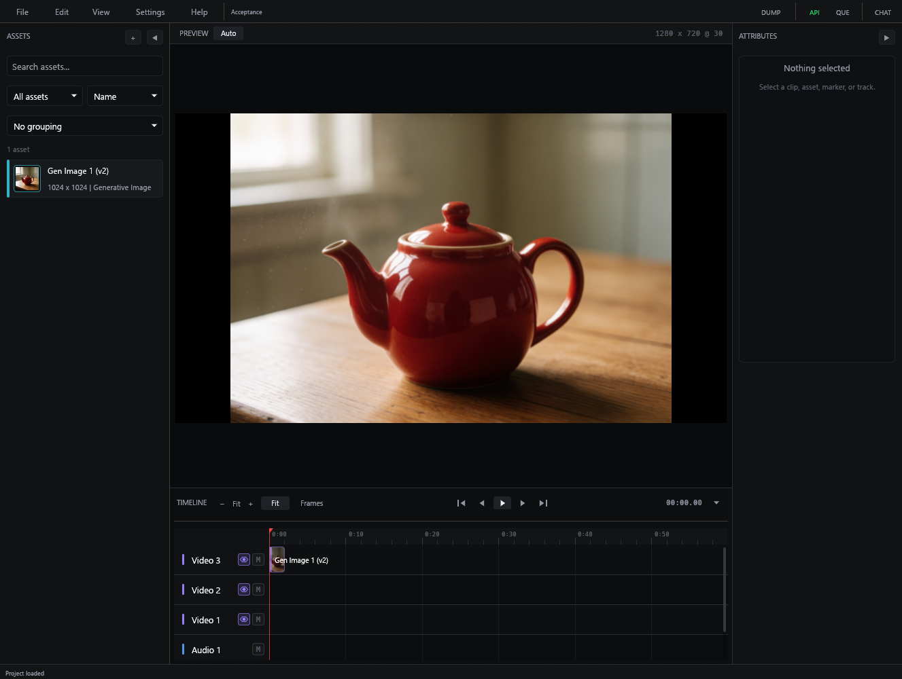

| Studio normal | Studio narrow |
|---|---|
| 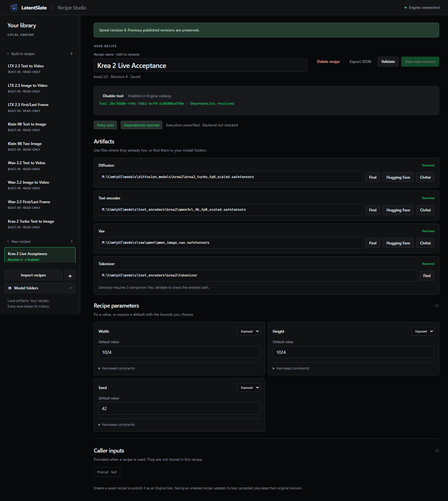 | 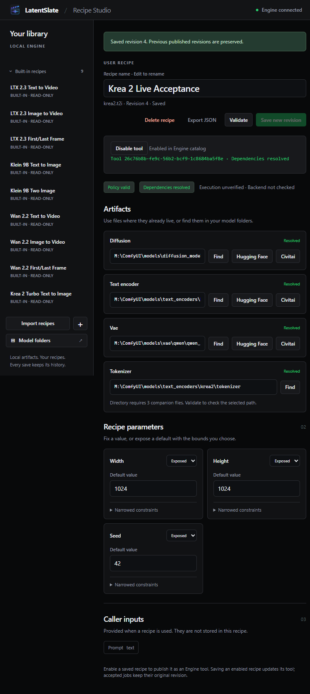 |

| Ordered adapters normal | Ordered adapters narrow |
|---|---|
| 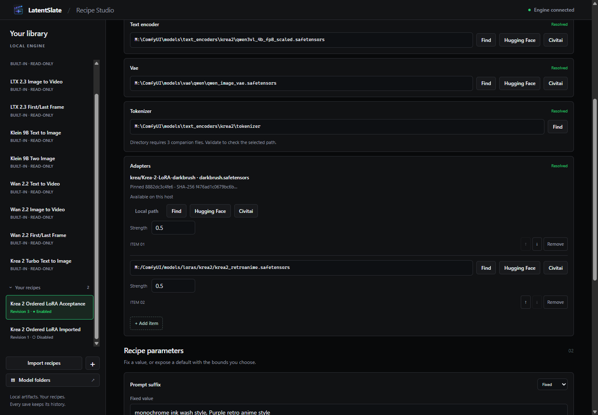 | 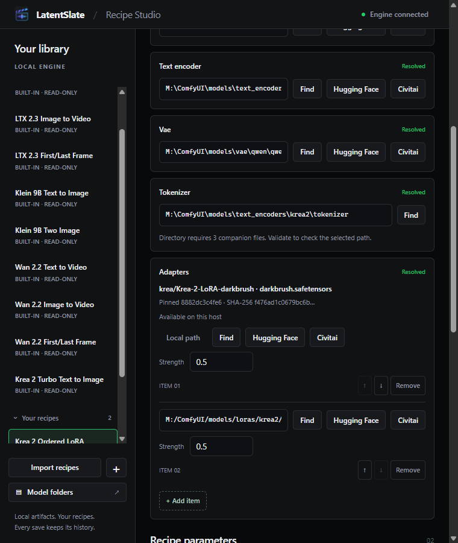 |

## Verification and stopping boundary

[verification.json](verification.json) records the final Windows Engine suite
(441 tests plus 27 subtests), passing Linux/macOS/Windows native-free CI, desktop
fmt/check, 228 desktop tests (one ignored), and successful release build,
runtime-DLL staging and deployment to the alternate test folder. The earlier
memory-pressure build failure was retried alone successfully.

Native GPU evidence is Windows/RTX5080/Torch CUDA only. Portable CI validates
contracts and imports, not Linux/macOS native GPU behavior. No generic
compatibility claim is made for other hardware, arbitrary checkpoint metadata
or unseen adapters. Full tensor dumps and larger image corpora are intentionally
local; selected public proofs are linked here. Final Home Lab review accepted the candidate without a concrete blocker;
main canonization is not authorized by this mission.

